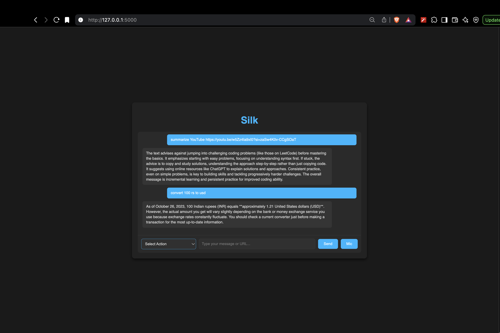
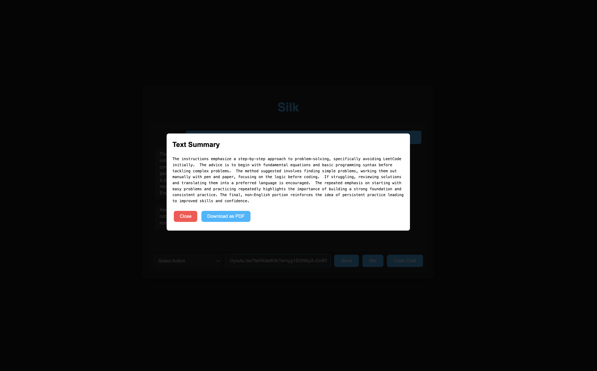
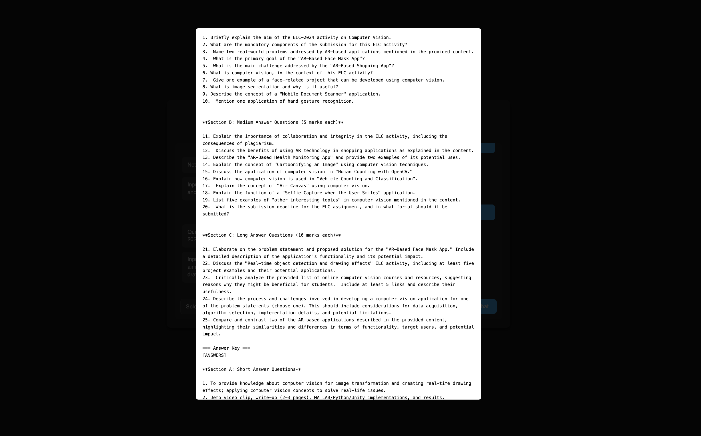
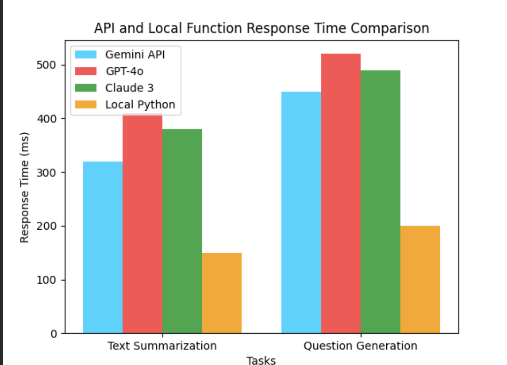

# GeminiTutor

**GeminiTutor** is an AI-powered educational assistant named **Silk**, developed by **Ashwinder Pal Singh**. Built using **Flask** and the **Google Gemini API**, Silk is designed to assist students, educators, and researchers with tasks like summarizing YouTube videos, generating notes, creating question papers, and more — all through a sleek, dark-themed interface inspired by ChatGPT.

---

## Features

- Summarize YouTube videos using transcripts or audio analysis  
- Generate structured study notes from text or PDF  
- Create question papers (short/medium/long answer) with answer keys  
- Extract specific thesis sections (e.g., methodology, conclusion)  
- Export generated content to polished PDF files  
- Freestyle voice or text chat, including Hindi support  
- Predefined personality-based responses (e.g., `Who made you → Ashwinder Pal Singh`)  

---

## Installation

### 1. Clone the repository
```bash
git clone https://github.com/your-username/geminitutor.git
cd geminitutor
```

### 2. Install dependencies
```bash
pip install -r requirements.txt
```

### 3. Configure Google Gemini API
- Sign up and get your API key from [Google AI Studio](https://makersuite.google.com/)
- Open `geminitutor.py` and replace the placeholder:
```python
API_KEY = "your-api-key-here"
```

### 4. Run the application
```bash
python geminitutor.py
```

Visit: [http://localhost:5000](http://localhost:5000)

---

## Usage

### Web Interface
Use your browser to interact with Silk via:
- Text input
- Voice (enable microphone access)

### Commands
| Command Example                        | Action                                     
|----------------------------------------|---------------------------------------------|
| `summarize YouTube <url>`              | Summarize a video                           
| `generate notes <content>`             | Generate notes from text/PDF                
| `generate question paper <source>`     | Create structured question paper            
| `Who made you?`, `आप कैसे हो?`           |  Freestyle chat / predefined response          

### PDF Export
All generated content (notes, papers) is saved as PDF in the project folder.

---

## Sample Outputs

Add your screenshots to a folder named `images/` inside your project directory and reference them like this:

### Home Interface  


### youtube summary Notes Generation Example  


### Question Paper Output  



---

## API Response Time Comparison

GeminiTutor uses the Google Gemini API. Here's a performance comparison across different APIs and local processing:

| Task                  | Gemini API (ms) | GPT-4o (ms) | Claude 3 (ms) | Local Python (ms)|
|-----------------------|----------------|-------------|---------------|-------------------|
| Text Summarization    | 320            | 410         | 380           | 150               |
| Question Generation   | 450            | 520         | 490           | 200               |


### API Speed Comparison Chart  


---

## Feature Comparison

| Feature              | Gemini API       | GPT-4o API         | Claude 3 API      | Local Python         |
|----------------------|------------------|--------------------|-------------------|----------------------|
| Multimodal Support   | Yes              | Yes (Text, Images) | Yes (Text, Images)| No (Text Only)       |
| Context Window       | 1M tokens        | 128K tokens        | 200K tokens       | Limited              |
| Scalability          | Cloud-based      | Scalable           | Scalable          | Depends on device    |
| Cost                 | Free Tier        | Usage-Based        | Usage-Based       | Free                 |
| Ease of Use          | SDK + CLI        | SDK Available      | SDK Supported     | Manual Only          |

---

## Requirements

- Python 3.8+
- Python Libraries:
  - `Flask`, `requests`, `fitz`, `pyttsx3`, `sounddevice`, `scipy`  
  - `youtube-transcript-api`, `faster-whisper`, `fpdf`, `pytesseract`  
  - `Pillow`, `pdf2image`, `yt-dlp`, `matplotlib`

---

## Contributing

1. Fork the project  
2. Create a new feature branch  
```bash
git checkout -b feature-name
```
3. Commit your changes  
```bash
git commit -m "Add feature"
```
4. Push and open a Pull Request  
```bash
git push origin feature-name
```

---

## License

This project is licensed under the MIT License.  
See [`LICENSE`](LICENSE) for full details.

---

## Acknowledgments

- Developed by Ashwinder Pal Singh  
- Powered by the Google Gemini API
